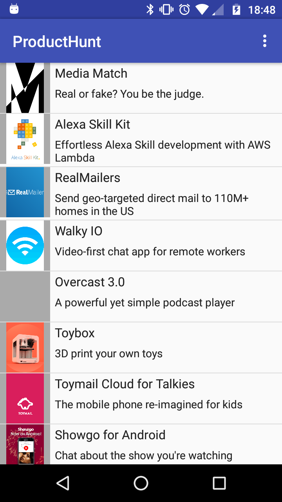

<style>

p {font-size: 0.8em; text-align: justify;}
.source {color: #ccc; font-size: 0.7em;}
pre{background-color: #222 !important;}

h1 { font-size: 1.8em !important; }
h2 { font-size: 1.6em !important; }
h3 { font-size: 1.4em !important; }
h4 { font-size: 1.2em !important; }
h5 { font-size: 1.1em !important; }
h6 { font-size: 1.0em !important; }

img[alt=screenshot]{
  display: block;
  margin: auto;
  width: 200px;
  margin: 20px auto 20px auto;
}
</style>

# Compte rendu TP ProductHunt
*ARNOUTS Sylvain, HUBER Bastien, TERRAL Guillaume*

## Introduction

Pour ce TP de conception d'application Android, blablabla.

Nous repartons de l'application codée par Mohammed lors des TP, dont voici une capture d'écran :


Bla bla.


```java
// Un snipper java
class TonPere implements TaMere {
  public static String coucou;
}
```
